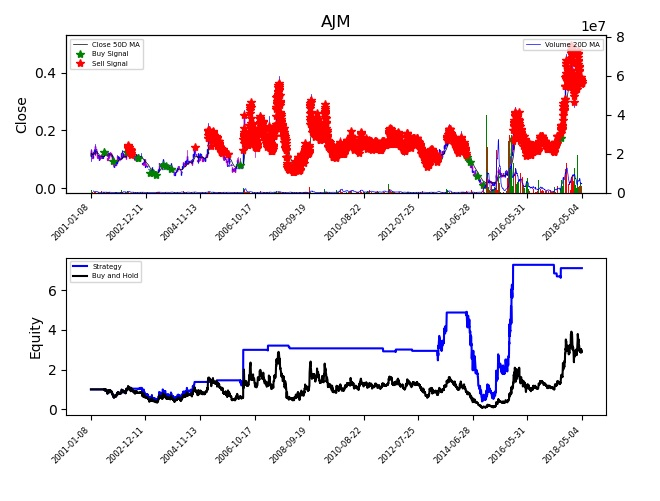

<p align="center">
    A Python application to backtest your trading strategies!
    <br>
    <br>
    <a href="https://img.shields.io/github/pipenv/locked/python-version/jrandj/FPL-draft-picker" alt="Python version">
        
    </a>
    <a href="https://img.shields.io/github/license/jrandj/FPL-draft-picker" alt="Python version">
        
    </a>
</p>

# Stock-Backtester

Stock-backtester is a Python application for testing trading strategies against historical data.

Running stockbacktester.py will test the buying and selling of stocks based on strategy parameters. The strategy parameters for buy signals are defined using: 
* Today's volume above the 20 day moving average volume.
* Today's close price change compared to the previous day price change.

The buy signal is intended to model accumulation (i.e. large volume increase with minimal price increase). 

Sell signals are generated using:
* Profit required for exiting the currently held position.

## Architecture

The package structure is shown below:
	<p align="center">
	
	</p>

The class structure is shown below:
	<p align="center">
	
	</p>

The diagrams have been using pyreverse:
```bash
pyreverse -o png .
```

## Output
The output is stored in three SQL database tables.

### Performance
Contains the performance of a particular strategy on a particular stock.

### Transactions
Contains the transactions associated with a particular strategy and stock (i.e. a row in the performance table).

### Signals
Contains occurances of buy and sell signals associated with a particular strategy and stock (i.e. a row in the performance table). This is useful as there can be more signals than transactions. For example, if a long position is already held then a buy signal does not result in a buy transaction.

### Plot
If write_results in config.py is set as 0 then a plot will be produced. An example is shown below:



## Getting Started

### Pre-requisites

* Python 3.9.7
* Microsoft SQL Server
* SQL Server Management Studio

### Installation

Use [pipenv](https://github.com/pypa/pipenv) to install stock-backtester.

1. Create the virtual environment:
    ```bash
    pipenv install
    ```

2. Activate the virtual environment:
    ```bash
    pipenv shell
    ```

To check for and update outdated packages run `pipenv update --outdated`. To uninstall run `pipenv uninstall`.

### Settings
Modifiable settings contained within config.py are described below:

path: The path to the historical data. This location should contain a .csv containing historical data per stock. The required format of the data in each file is shown below:

| Date        | Open           | High  | Low  | Close  | Volume  | Ticker  | 
| ------------- |:-------------| :-----| :-----| :-----| :-----| :-----| 
| 20150609      | 0.19769 | 0.19769 | 0.14378 | 0.15725 | 5217129 | 1ST |

csv_file: After the first execution each .csv file is consolidated into a .csv file with this name.

hdf_file: After the first execution the consolidated .csv file is stored as a .hdf file with this name. This improves the performance of subsequent reads of the historical data.

write_results: If 1 no plot is provided and the results are written to the database, if 1 a plot is produced and no results are written to the database.

tickers: A list of strings containing the tickers that will be backtested.

required_profit: An array containing the minimum, maximum and step size for this strategy parameter. Each step will be backtested.

required_pct_change_max: An array containing the minimum, maximum and step size for this strategy parameter. Each step will be backtested.

required_volume: An array containing the minimum, maximum and step size for this strategy parameter. Each step will be backtested.

params: The database connection string.

performance_table: The name of the database table that will store the performance results.

transactions_table: The name of the database table that will store the transactions results.

signals_table: The name of the database table that will store the signal results.

transaction_fee: The transaction fee that will apply to each transaction.